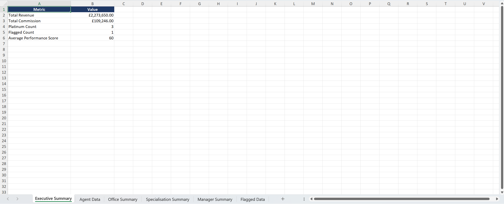
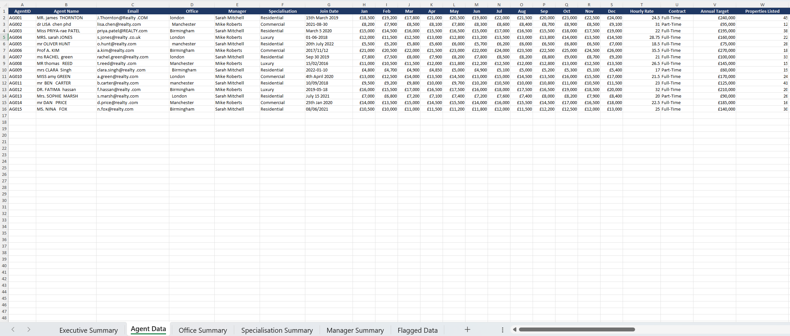
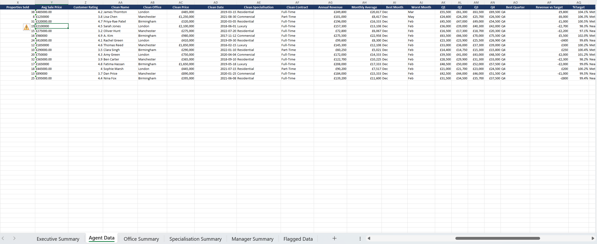
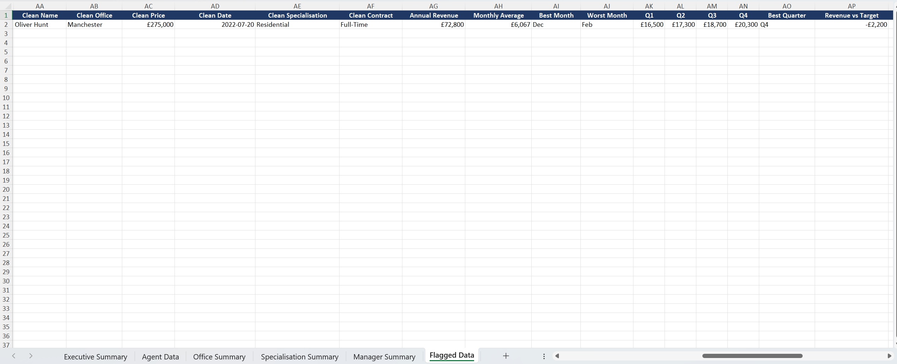
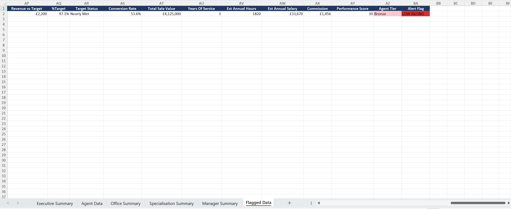

# Agency Performance Reporting System

## Overview

Agency Tracker is an automated reporting system created via Python/Pandas. It processes raw agency data, cleans and formats it, performs business calculations, and exports a business-ready Excel report.

## Features

- Cleans and standardises raw data through removal of whitespaces, unnecessary information, normalising formatting and preparation for analysis.
- Calculates business KPIs including commissions, performance scores, target attainment, and revenue metrics.
- Produces dedicated summary sheets for offices, specialisations, managers, and flagged records.
- Applies conditional formatting to highlight flagged data and performance tiers.

## Background

A highly frequent issue that businesses encounter is with collected data being immense and unorganised. As a result, it’s essentially impossible to draw meaningful conclusions or key statistics from the data, therefore monitor performance without a manual effort – a strenuous and time-consuming task. This project was designed to automate that process through cleaning inconsistent data, calculating KPIs, creating summary sheets and highlighting issues that need to be addressed. As a result, the reporting process is faster, more consistent and easier to interpret.

## Technologies Used:
- Python
- Pandas
- OpenPyxl
- Excel

## Requirements
- Python 3.11+
- pandas
- numpy
- openpyxl
- dateparser

## How to Run
1. Ensure Python and the required libraries are installed.
2. Place the input CSV file (final_raw.csv) in the project directory (or provide it as a command-line argument).
3. Run the script:
	python Agency_Tracker.py
4. The generated Excel report will be saved automatically.

Output:
The generated Excel workbook contains:
•	Executive Summary
•	Agent Data
•	Office Summary
•	Manager Summary
•	Specialisation Summary
•	Flagged Data
The report includes cleaned data, calculated KPIs, conditional formatting, and management summaries ready for business use.

## Screenshots

### Executive Summary

### Agent Data - Raw to Clean Transformation & Calculations

### Agent Data - Flagged Data

